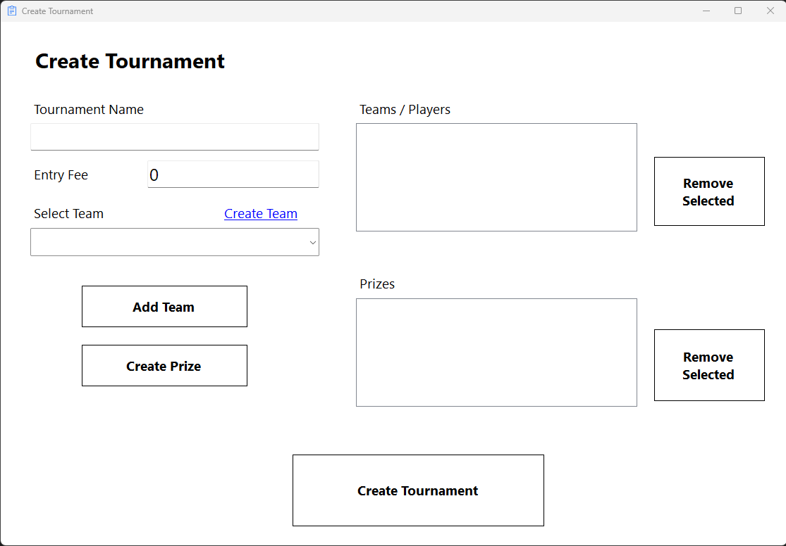
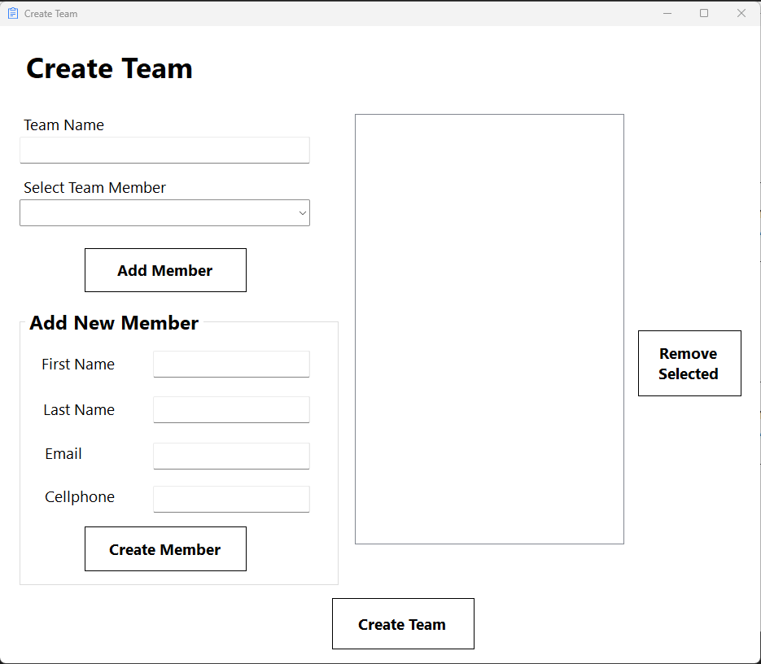
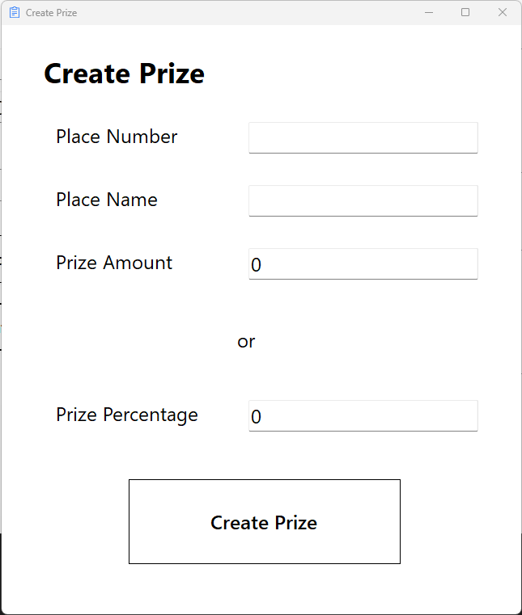

# Tournament Tracker Application
 Tournament tracker application built in C# following a freeCodeCamp tutorial.

 ## Description
 This application is a tournament tracker that allows you to create tournaments, teams, and players. You can also create matchups and keep track of the scores. The application is built in C# using Windows Forms.

 ## Features
 - Create tournaments
 - Create teams
 - Create players
 - Create matchups
 - Keep track of scores
 - Advance winners to the next round
 - Declare a winner

  ## Technologies
  - C#
  - Windows Forms
  - SQL Server
  - Dapper

  ## How to use
  1. Clone the repository
  2. Open the solution in Visual Studio
  3. Run the application

  ## License
  This project is licensed under the MIT License - see the LICENSE.md file for details.

## GUI
### Create Tournament:

### Create Team:

### Create Prize:

